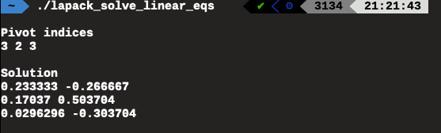

# LAPACK with C++

Now that we have a solid understanding of how each LAPACK subroutine is implemented, let's  solve a real problem with LAPACK! We choose C++ here to demonstrate how to call Fortran function in C++ code --- a common practice in HPC.

To call FORTRAN function from C++, you just need to write a wrapper using the `extern` keyword:

```text
extern "C" {extern return_type fortran_function_(*arg1, *arg2, ...)}
```

That's it! Take a look of the cpp code below, where I call the `SGESV` to solve a set of real linear equations.

```text
// Solve the following linear equations
// AX=B
// A = 0 5 5
//     2 9 0
//     6 8 8
// B = 1 1
//     2 4
//     3 0

#include <iostream>

using namespace std;

// C wrapper for the LAPACK library
extern "C" {
extern void sgesv_(int*,int*,float*,int*,int*,float*,int*,int*);
}


int main(int argc, char** argv){

    int n= 3;
    int nrhs = 2;
    float A[] = {0,2,6,5,9,8,5,0,8}; //column-majored in Fortran!
    int lda = n;
    int ipiv[n];  //pivot indices. 
    float B[] = {1,2,3,1,4,0}; 
    int ldb = n;
    int info;
    
    //solve AX=B
    sgesv_(&n,&nrhs,A,&lda,ipiv,B,&ldb,&info);

    if(info == 0){
    //ipiv = {3,2,3}
    //swap 1st row with the 3th row
    //swap 2nd row with 2nd row
    //swap 3rd row with 3rd row
    cout << endl << "Pivot indices" << endl;
    for (int i=0; i<n; i++){
        cout << ipiv[i] << " ";
    }
    cout << endl;
    
    //print solution X which is stored in B
    cout << endl << "Solution" << endl;
    for (int i=0; i<n; i++){
        for (int j=0; j<nrhs; j++){
            cout << B[i + j*n] << " ";
        }
        cout << endl;
    }
    cout << endl;
    }
}


```

Several points to emphasize:

1. A Fortran routine is known to C by its name in lowercase, with underscore appended
2. Fortran passes all arguments by reference. So you need declare the function in`extern "C" {}` with all arguments as pointers.
3. Arrays in Fortran are stored by column, arrays in C are stored by row. 
4. Index numbering in Fortran starts with 1, in C it starts with 0.

If you install LAPACK properly, we are ready to compile above C++ code as follows: 

```text
g++ -o lapack_solve_linear_eqs lapack_solve_linear_eqs.cpp -llapack
```

If everything goes properly you should see the correct solution:



Congratulations! You are now ready to march toward SCALAPACK!

